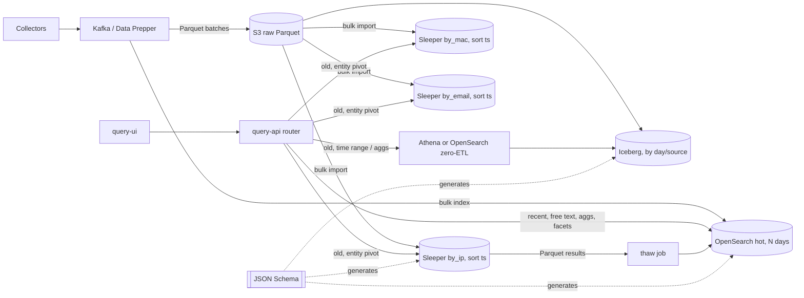

# Sleeper (gchq/sleeper) as a lakehouse alongside OpenSearch

Research date: 2026-10-06. Sources are the Sleeper `develop` docs (v0.38.0, 2026-10-02), OpenSearch 3.x docs
and AWS/Elastic material; links inline. Facts from Sleeper's docs are quoted or paraphrased; where the docs
say nothing the text says "not documented".

## Verdict

Sleeper is viable as a **cold, entity-keyed archive** behind the query API, not as a replacement for
OpenSearch and not as a general query engine. It is a serverless key-value store: "a request for all rows
where the key is in a range (or in one of a list of ranges)" (design.md). Everything that is not a range on
the leading row-key field is a scan plus post-filter. It has no inverted index, no secondary index, no
full text, no aggregations of its own, no date/IP/boolean/geo/vector types, and no Go client. Its strengths
are the opposite of OpenSearch's: petabyte-scale Parquet on S3, near-zero idle cost, thousands of
~0.5 s key lookups in parallel, and ingest of very large batches.

Recommended shape: **OpenSearch for hot interactive search (N days), Parquet on S3 as the system of record,
Sleeper tables for cold entity pivots (by IP, MAC, email ...), and an Iceberg/Athena (or OpenSearch zero-ETL)
path for cold time-range scans and aggregations**, all generated from the one JSON Schema we already use.
Details and alternatives in sections 3 and 4.

## 1. Can the query API use Sleeper?

Yes, as a second backend, with three constraints.

- **No Go client.** Supported language-neutral paths are: a JSON query message on the instance's SQS query
  queue with Parquet results in the `sleeper-<instance>-query-results` bucket or an SQS results queue; the
  API Gateway WebSocket stack (same JSON, rows streamed back); the Trino plugin (JDBC); and the experimental
  Athena connector. The REST API stack currently exposes only `POST /sleeper/tables`, no query endpoint
  ([rest-api-overview](https://github.com/gchq/sleeper/blob/develop/docs/usage/rest-api/rest-api-overview.md),
  [data-retrieval](https://github.com/gchq/sleeper/blob/develop/docs/usage/data-retrieval.md)). From Go, the
  WebSocket or SQS path is the realistic one; both are asynchronous.
- **Query shape.** Only `regions` over row-key (and sort-key) ranges are pushed down. Value-field predicates
  run as query-time iterators (Java classes loaded from S3) or, with `sleeper.table.query.data.engine=datafusion`,
  as an experimental SQL `processingConfig.sqlQuery` over the scanned rows
  ([data-processing](https://github.com/gchq/sleeper/blob/develop/docs/usage/data-processing.md)). The
  roadmap lists "Create a predicate language for specifying filters on queries" as open work
  ([roadmap](https://github.com/gchq/sleeper/blob/develop/docs/development/roadmap.md)).
- **Latency and freshness.** "A query for rows where the key takes a given value takes around half a second,
  but many thousands can be run in parallel" (README). Lambda cold starts add to that; a keep-warm stack pings
  the query lambdas every five minutes. Ingest is batch only: "There is currently no option to ingest the data
  in a way that makes it immediately available to queries"
  ([ingest](https://github.com/gchq/sleeper/blob/develop/docs/usage/ingest.md)). Query lambdas refresh table
  state every 60 s, so results can lag slightly ([risks](https://github.com/gchq/sleeper/blob/develop/docs/design-risks-and-mitigations.md)).

What this means for `query-api`: our typed filter DSL maps onto Sleeper only for the subset
`eq`/`in`/`prefix`/`between` on the table's row key plus a time range on the sort key. Everything else
(wildcard, match, cidr on a non-key field, geo, exists, aggregations) would have to be applied by the API
after the rows come back, or declined for cold queries. The API would also need an async result model
(job id, poll or stream), since Sleeper answers via S3/SQS/WebSocket rather than a synchronous HTTP body.

Deployment: AWS only today (CDK; S3, DynamoDB, SQS, Lambda, ECS/Fargate, EMR Serverless, EventBridge,
API Gateway). LocalStack support is "limited functionality... small volumes"
([deploy-to-localstack](https://github.com/gchq/sleeper/blob/develop/docs/deployment/deploy-to-localstack.md)).
Licence Apache-2.0, pre-1.0 (v0.38.0), minor release every one to three months, no production-use statement.

## 2. Search, filtering and field mapping compared with OpenSearch

Legend for the Sleeper column: native = row-key range pushdown; iterator = post-scan filter (Java iterator
or DataFusion SQL); n/p = not possible; n/d = not documented.

| Capability | Sleeper | OpenSearch 3.x |
|---|---|---|
| Exact match | native on row key; iterator on values | `keyword` + `term`/`terms` |
| Prefix | native on row key (a prefix is a key range; Trino pushes `LIKE 'x%'`) | `prefix`, `search_as_you_type`, `match_phrase_prefix` |
| Wildcard / regex | n/p natively; iterator | `wildcard`, `regexp`, `wildcard` field type |
| Full text (tokenisation, phrase, fuzzy, stemming, multi-field) | n/p (no inverted index) | `text` + analysers; `match`, `match_phrase`, `fuzzy`, `multi_match`, `query_string`, `intervals` |
| Case-insensitive keyword | n/d (single `StringType`, byte order; pre-normalise the key) | `keyword` + `normalizer` |
| Numeric range | native on Int/Long row key, or sort key after key equality; iterator on values | numeric types + `range` |
| Date range, date math, time histogram | no date type (epoch Long); range native on key; date math and histograms n/p server-side | `date`, `range` with date math, `date_histogram` |
| IP exact / CIDR / IPv6 | no IP type; fixed-width binary key makes CIDR a byte range (n/d as a feature) | `ip` type, `term` with CIDR, `ip_range` agg |
| MAC address | String/ByteArray key (n/d) | `keyword` |
| Email tokenised | n/p | `uax_url_email` tokenizer or `keyword` multi-fields |
| Boolean | no type (Int value); iterator | `boolean` |
| Arrays | `ListType` value only, not a key; iterator | any field; `terms`, `terms_set` |
| Nested / maps | `MapType` value only; iterator | `object`, `nested`, `flat_object` |
| Geo | n/p | `geo_point`, `geo_shape` + geo queries |
| Vector / semantic | n/p | `knn_vector`, `neural`, `hybrid` |
| Aggregations | iterator or DataFusion SQL over the scanned range; Trino/Athena aggregate client-side | native `terms`, `cardinality`, `stats`, `percentiles`, `date_histogram`, `composite` |
| Sorting | row-key then sort-key order only | any doc_values field |
| Pagination / counts | n/d; results delivered whole to S3/SQS/WebSocket | `search_after`, PIT, `track_total_hits` |
| Secondary indexes | none; "a query for all rows where key2 has a specified value but key1 can take any value will not be quick" | every mapped field indexed |
| Schema | explicit row/sort/value fields; key types Int, Long, String, ByteArray; evolution by reinitialising the table | dynamic or explicit mapping; type change = reindex |
| Query language | JSON `regions`; Java/Python/CLI clients; optional DataFusion SQL; Trino/Athena | Query DSL, Lucene, SQL, PPL |
| Freshness | batch ingest only | near-real-time |
| Security | row/cell filtering via a query-time iterator fed by a fronting service; field-level n/d | DLS, FLS, masking; JWT/OIDC/SAML/LDAP |
| Cost at rest | Parquet (zstd) in S3; idle cost is storage | hot nodes; warm/cold tiers read-only |

Sources: [schema.md](https://github.com/gchq/sleeper/blob/develop/docs/usage/schema.md),
[design.md](https://github.com/gchq/sleeper/blob/develop/docs/design.md),
[trino.md](https://github.com/gchq/sleeper/blob/develop/docs/usage/trino.md),
[fine-grained-security.md](https://github.com/gchq/sleeper/blob/develop/docs/usage/fine-grained-security.md),
[OpenSearch field types](https://docs.opensearch.org/latest/mappings/),
[OpenSearch query DSL](https://docs.opensearch.org/latest/query-dsl/).

Read the table as: Sleeper's one fast operation is "all rows for this key (range), in time order". Our
Lucene bar, full-text and semantic modes, facets, histogram and most builder operators have no Sleeper
equivalent.

## 3. Using both: a lakehouse with advanced search

Principle: Parquet on S3 is the system of record; OpenSearch is a derived, time-bounded index; Sleeper
tables are derived, key-ordered copies, one per pivot. One JSON Schema generates all three (our schema
loader already emits OpenSearch mappings; a Sleeper schema is a small extra emitter: keys as
`StringType`/`LongType`/`ByteArrayType`, timestamps as epoch `LongType`, nullable values).

Routing rules in the API:

- Time range entirely within the hot window, or any full-text/Lucene/semantic/wildcard/geo clause, or any
  facet/histogram request: OpenSearch only.
- Older than the hot window and the filters contain an equality or prefix on a pivot field (IP, MAC, email,
  host, trace id): the matching Sleeper table, sort-key range for time, remaining filters applied in the API.
- Older than the hot window with only time plus arbitrary predicates or aggregations: Athena over Iceberg
  (per-TB pricing) or OpenSearch zero-ETL direct query on the S3 tables.
- Ranges spanning the seam: fan out, merge by `(timestamp, _id)`, merge only count/sum/min/max/terms-with-overfetch
  aggregations; refuse or approximate percentiles and cardinality across the seam.

Field handling for "advanced search" on cold data:

- Full text, tokenised, email local-part/domain: not available in Sleeper. Either keep those fields searchable
  in OpenSearch for longer, run Athena `LIKE`/regex over Iceberg (slow, scan priced), or thaw a window/entity
  into a temporary OpenSearch index.
- IP/CIDR: store the IP as 16-byte big-endian `ByteArrayType` so IPv4 and IPv6 sort correctly and a CIDR
  block becomes one byte range on the key. MAC: six-byte `ByteArrayType` or lowercase string key.
- Dates: sort key `event_ts` as epoch millis Long; range on the sort key after key equality.
- Everything else (booleans, enums, numbers): value fields, filtered in the API after retrieval.

Write path: dual-write from the pipeline (OpenSearch bulk plus Parquet to S3, then Sleeper bulk import via
EMR Serverless and the ingest batcher). Exporting from OpenSearch to Parquet is possible but loses fields the
mapping dropped and gives the index authority over the lake; CDC out of OpenSearch is not supported. AWS
documents the "recent in OpenSearch, archive in Parquet" pattern with a 4,800% cost reduction
([AWS blog](https://aws.amazon.com/blogs/big-data/reducing-long-term-logging-expenses-by-4800-with-amazon-opensearch-service/)).

Thaw: a Sleeper key or range query writes Parquet to the results bucket; a Glue/Spark job indexes that into
`thaw-<case>` with an ISM delete TTL, so investigators get full search over the thawed slice.

## 4. Hot/cold storage, and why Sleeper alone is not the cold tier

Option A, OpenSearch-only tiering: ISM rollover hot to warm to cold to delete. Open-source searchable
snapshots (`storage_type: remote_snapshot`, `warm` node role) are slower than local disk, bill per object
request, and cap at 1,000 remote shards per warm node
([docs](https://docs.opensearch.org/latest/tuning-your-cluster/availability-and-recovery/snapshots/searchable_snapshot/)).
AWS UltraWarm is read-only S3-backed (about $0.024/GB-month, seconds latency); AWS cold storage must be
migrated back to warm before reading (tens of seconds to minutes; about 130 min per 100 GB warm-to-hot)
([AWS tiers](https://aws.amazon.com/blogs/big-data/choose-the-right-storage-tier-for-your-needs-in-amazon-opensearch-service/)).
Writable warm (OpenSearch Service 3.3+) removes the read-only limit but has no cold tier yet. Elastic's
frozen-tier benchmark: cached p99.9 of 0.56 to 11 s versus hot 0.54 to 2 s, with up to 90% storage saving
([Elastic](https://www.elastic.co/search-labs/blog/searchable-snapshots-benchmark)). This keeps full search
on cold data but still pays for an inverted index per GB.

Option B (recommended), hot OpenSearch plus lake: hot window of 7 to 30 days in OpenSearch, everything in
Parquet. Sleeper covers the cold entity-pivot access path (one table per pivot, so 3 to 5x storage, still
cheaper than one OpenSearch replica at S3 prices). Iceberg plus Athena or OpenSearch zero-ETL covers cold
time-range scans and aggregations, because Sleeper rejects queries without a row-key filter in Trino and
would full-scan otherwise.

Option C, Sleeper as the sole cold store via Trino federation: `UNION ALL` of the OpenSearch connector and
the Sleeper plugin. Simpler, but time-only cold queries are impossible and the Trino plugin is pinned to
Trino 390.

Row/sort key design for security data: row key = entity (`ByteArrayType` IP, or `entity_type|value`
string), sort key = `event_ts`. Composite keys only help prefixes; a time-bucketed key (`day|ip`) prevents
hot partitions but breaks cross-day entity lookups. Parquet page min/max statistics are the only skip
index; Sleeper has no bloom filters, so a miss on a high-cardinality key still reads a page per column per
file. Compaction-time iterators can deduplicate or pre-aggregate.

Reading Sleeper's S3 files directly with Athena/Trino/DuckDB is unsafe: live files include pre-compaction
duplicates and not-yet-collected files; the authoritative list is in the DynamoDB transaction-log state
store. Use the connectors or bulk export instead
([transaction-log](https://github.com/gchq/sleeper/blob/develop/docs/design/transaction-log-state-store.md),
[export.md](https://github.com/gchq/sleeper/blob/develop/docs/usage/export.md)).

## 5. Gaps: OpenSearch as the lake versus Sleeper

OpenSearch as the whole lake: full search on everything, but hot storage priced for an inverted index,
read-only warm/cold tiers with restore latency, shard-count and heap limits at petabyte scale, and
reindex-on-mapping-change. Cheapest to build, most expensive to run at scale.

Sleeper as the whole lake: cheapest at rest and unbounded in volume, but it cannot serve our UI. Concretely,
compared with what `query-api` and `query-ui` do today:

| Gap | Impact on our stack | Mitigation |
|---|---|---|
| No full text, wildcard, regex | Lucene bar, text mode, `wildcard`/`match` ops | Keep in hot OpenSearch; Athena `LIKE` over Iceberg; thaw |
| No aggregations | Facets, histogram, values/autocomplete endpoints | Iceberg/Athena or zero-ETL; pre-aggregate at compaction; DataFusion SQL (experimental) |
| One access path per table | Dynamic filter on any field | One Sleeper table per pivot; Iceberg for the rest |
| No date/IP/bool/geo/vector types | Typed ops, CIDR, geo, semantic | Encode IP/MAC as fixed bytes, time as Long; geo and vectors stay in OpenSearch |
| Async results (S3/SQS/WebSocket), ~0.5 s+ per key | Synchronous infinite scroll | Job model in the API: submit, poll or stream, "cold results pending" in the UI |
| Batch ingest, 60 s state refresh | Live tail | Hot tier handles recency |
| No Go client, REST has no query endpoint | Our Go API | SQS or WebSocket client in Go; or Trino/Athena JDBC via a sidecar |
| AWS only, CDK, Java 17, Trino 390 pin | Local dev, portability | LocalStack for small tests; keep Iceberg copy for portability |
| Pre-1.0, ~100 stars, no production statements, format changes | Risk | Pin releases; bulk export as escape hatch |

## Suggested next steps if we proceed

1. Add a `SleeperSchema()` emitter next to `IndexMapping()` in `internal/schema` (keys, sort key, epoch
   Longs, byte-encoded IP/MAC) and a `x-sleeper` block in the JSON Schemas to mark pivot tables.
2. Add a `tier` field to the query request (`hot`, `cold`, `auto`) and a router in `internal/query` that
   decides OpenSearch versus Sleeper versus Athena from the time range and filter shape, returning a job id
   for asynchronous cold queries.
3. Prototype the Go WebSocket client against a LocalStack Sleeper instance with a `by_ip` table built from
   `ds_web_logs`, measure key-lookup latency, and decide whether Athena over Iceberg should carry all cold
   queries instead.
